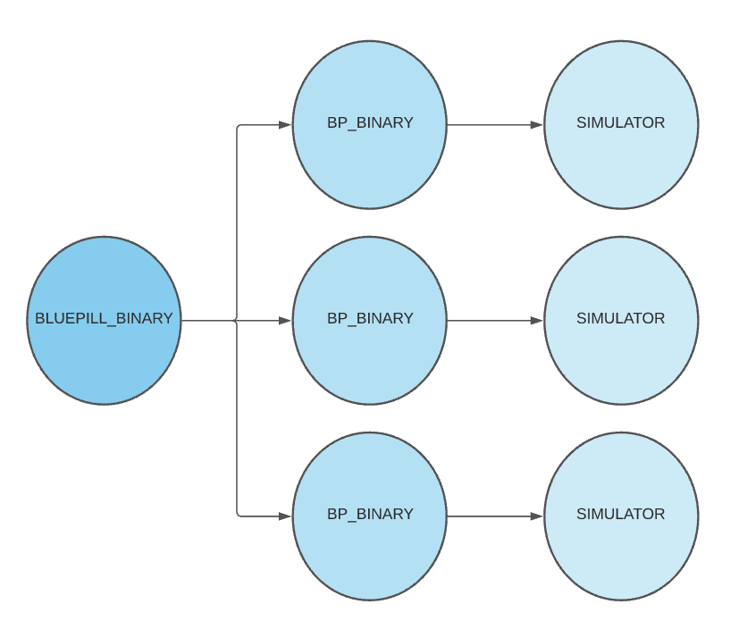
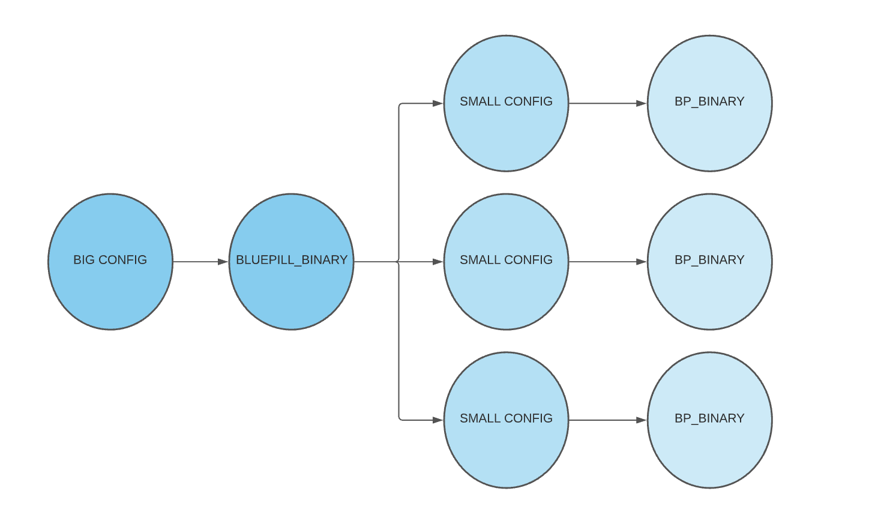
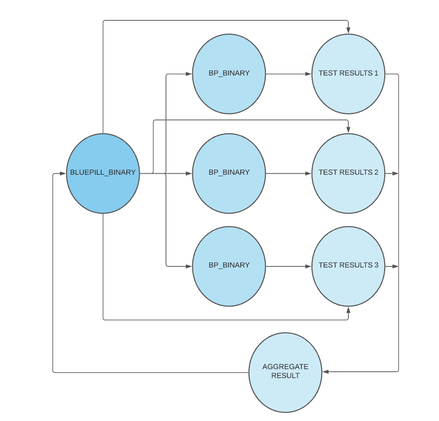
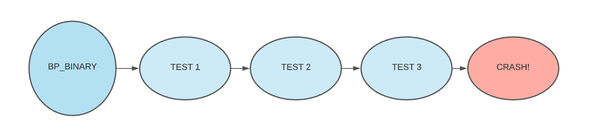

## iOS Simulator Architecture

- App (builds with) -> (Xcode/Bazel) -> `X.app` (packaged into an IPA, an archive of the app or "Bundle")
- iPhones have ARM processors while Macs have `x86_64` (pre M1 at least)
- Compilation -> Architecture specific binary (or app binary)

## Bluepill Build
- `bluepill.sh` builds Bluepill in CI (It has a sample app)
- Technically the script builds Bluepill, the sample app and runs the tests
- `BPSampleApp.app` is the "bundle", an x86_64 bundle but iPhone needs an ARM executable
	- "Fat binary" will have both
- Side note: iOS is a variant of MacOS and Android ships a VM with a Linux based Android kernel
- Originally Apple Emulators translated ARM -> `x86_64` but that was very slow!
	- Helped test iOS apps in Mac by giving you an `x86_64` executable
- Now they compile all frameworks for `x86_64` and give you a sandbox in which you can build a native binary
	- It's faster to get an exectuable to test this way


## More Wisdom from Oscar
- `xcrun simctl boot` will boot the simulator (Alternatively run Simulator.App in /Applications/Xcode.App)
- `ps axuw | grep 'launchd_sim'` -> This is the `launchd` process running inside the Simulator
	- Since the Simulator isn't a VM (like Android) and shares the same Kernel as the underlying Mac OS, it's possible to inspect the processes running inside the simulator
	- `ps axiw | grep 'CoreSimulator'`
- `xcrun simctl install .... BPSampleApp.app`
- Kernel runs with special persmissions (Ring 0) that user programs aren't privy to
	- Copy of iOS runs in user space of MacOS Kernel
- The VM model: Multiple Kernels that share the same processor
	- CPU -> Kernel1 (OS1)/Kernel2 (OS2)/Kernel3 (OS2)
- `otool -L MacOS/Simulator`
	- Inspect Frameworks -> /Library/Developer/PrivateFrameworks/CoreSimulator..
	- Bluepill links with PrivateFrameworks (like simctl)
- All functionality is provided as a framework. Simluator UI uses this library and so does Bluepill
- file CoreSimulator
	- Shows you a binary with 2 architectures for M1 compatibility
	- CoreSimulator.framework/Versions/A
		- Poke around to use the framework directly in Bluepill

## iOS Apps Test Classes
- UI Tests
	- Tests your app's UI
	- Uses accessibility API of iOS
	- Stuff like asserts about things being on screen
- Unit Tests
	- Non UI assertions and these things run _very_ differently

## How we rely on XCTest Framework
`XCTest` is a _Plugin_
```
	bluepill/Build ... /BPSampleApp.app
	tree Base.lproj
	tree Frameworks

	XCTest.Framework
	tree Plugins (Used for writing Plugins which is runtime code for extra functionality)
```

## How Bluepill runs the tests
`BPSampleTests.xctest` is a Bundle
	- Executable
	- Frameworks
	- CodeSignature
	- Info.plist (`plutil -p Info.plist`)

- `FBundleIdentifier` -> Handle that iOS is using for interaction with the App
- App loads the Plugin (`main -> loadPlugin`)
- App binary dynamically links to `.dylib` files using the dynamic loader
	- Dynamic loader maps a `.dylib` hook to its location in memory (Part of OS funcitonality)
	- `man dyld` (See `DYLD_INSERT_LIBRARIES` option which is what we use in Bluepill)
	- The _trampoline_ code to do this is in `libSystem.B.dylib` (part of the kernel space)
- `otool --help`
	- `otool -L /bin/ls`
	- Gives OS a memory map telling it where to load the libraries in app code
- Dynamic Loader can inject libraries *before* app loads its dynamic libraries
	- `DYLD_INSERT_LIBRARIES`
	- So `libXCTestBundleInject.dylib` gets injected before App runs
- Loads `XCTestFramework`, discover tests (Unit Testing) and runs them


## UI Testing
- Xcode generates `<Appname>UITestsRunner.App`
- Load Runner App that runs your application in a Leader/Follower model
- UI Automation is involved here.. and in comes Bluepill

```
tree BPSamepleApp/Plugins
		 ...xctest1
		 ...xctest2
```
- Hydra ran these tests serially
- However if we had X tests and X simulators running in _parallel_, things would be a lot quicker!
- Interaction with PrivateFrameworks is hacky

## Bluepill High Level Architecture


- `BLUEPILL_BINARY` is a command line application
	- `bluepill/main.m`
	- Starts with the most important task of a Matrix-style opening sequence ;)
	- `BPConfiguration.h` -> App args/settings processor which accepts command line or JSON arguments and differentiates `BP_BINARY` and `BLUEPILL_BINARY` arguments
	- Create `BP_BINARY` processes to run simulators
	- Monitor Simulators for failure
	- Aggregate individual test results into a unified test result
- `BP_BINARY` is designed to run 1 simulator
	- `bp/src/main.m`
- If a single `BP_BINARY` instance crashes, then `BLUEPILL_BINARY` creates another one and picks up where the previous one left off, thus mitigating risk of data loss.
	- `BLUEPILL_BINARY` doesn't interact with the simulators directly for this very purpose (although this is technically untrue as of today)
	- `BLUEPILL_BINARY` eventually needed knowledge of the simulators and we ended up breaking original design.
- Bluepill is fully self contained and needs no external dependencies

## Running Bluepill
- `bluepill --config bp/tests/Resources ... config.json`

- `BPRunner.m`
	- How many `BP_BINARY` processes at a given time?
	- Packing algorithm gets all XCTestBundles in Plugins directory to determine the number of parallel simulators
	- X Tests : Y Simulators (What are some packing strategies?)
	- Perhaps Bluepill can use previous run's stats to determine the packing algorithm and weight by Bundle size if no prior knowledge exists. The key is to parallelize equally.
- `BLUEPILL_BINARY` aggregates the test results

- `BLUEPILL_BINARY` kepps CPU usage/memory details of all `BP_BINARY` processes
	- Similar to a Chrome Trace/Log

- When a single `BP_BINARY` process crashes, a new one is spawned to resume testing. Since results are aggregated at the end, killing and respawning `BP_BINARY` processes are somewhat cheap

## Summary
- `BLUEPILL_BINARY` is responsible for:
	- Packing algorithm
	- Planning the test run
	- Monitoring CPU/Memory usage
	- Aggregating test results

- `BP_BINARY` is spawned by `BLUEPILL_BINARY`
	- It runs a single simulator and runs one or more test bundles


